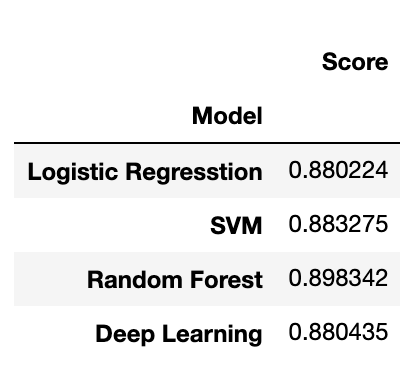

# Machine Learning - Exoplanet Exploration

[Background](#Background) | [Data Source](#DataSource) | [Model Creation](#MachineLearningModelCreation) | [Model Selection Report](#ModelSelectionReport)

## Background

Over a period of nine years in deep space, the NASA Kepler space telescope has been out on a planet-hunting mission to discover hidden planets outside of our solar system. To help process this data, machine learning models will be created in order to classify candidate exoplanets from the raw dataset.

## Data Source

[Kepler Exoplanet Search Results](https://www.kaggle.com/nasa/kepler-exoplanet-search-results): This dataset is a cumulative record of all observed Kepler "objects of interest" — basically, all of the approximately 10,000 exoplanet candidates Kepler has taken observations on.

## Machine Learning Model Creation

View Script -> [Logistic Regression](exoplanet_exploration/Testing/logistic_regression.ipynb) | [Support Vector Classification](exoplanet_exploration/Testing/svc.ipynb) | [Random Forest](exoplanet_exploration/Testing/random_forest.ipynb) | [Deep Learning](exoplanet_exploration/Testing/deep_learning.ipynb)

- **Preprocess the raw data**

    - Preprocess the dataset prior to fitting the model.

    - Perform feature selection and remove unnecessary features.

        * Apply the `RFE` method to identify the importance of each feature.
        
        * Select only the features that support the outcome. 

    - Use `MinMaxScaler` to scale the numerical data.

    - Separate the data into training and testing data.

- **Tune Model Parameters**

    - Use [GridSearch](https://scikit-learn.org/stable/modules/grid_search.html) to tune model parameters.

    - Tune model

- **Compare Models created**

    - Using model accuracy and resources used for choosing the best model
    

## Model Selection Report

<p align="center" href="https://scikit-learn.org/stable/tutorial/machine_learning_map/index.html" target="_blank"></p>


As the flowchart presented above, the model that would be the best estimator for prediction of candidate exoplanets is **Linear SVC (Support Vector Classification)** as the following assumptions.

- The model will predict categorical output (y).

- y is a labeled data.

- There are less than 100K samples in the dataset.

After training and fitting a model with selective features, applying GridSearchCV to tune the best model with different parameters. The result show that the best parameter is **'C': 1000, 'gamma': 1, 'kernel': 'linear'** with **88.23%** accuracy.

```javascript
# Defining parameter range 
param_grid = {'C': [0.1, 1, 10, 100, 1000],  
            'gamma': [1, 0.1, 0.01, 0.001, 0.0001], 
            'kernel': ['linear']}  

grid = GridSearchCV(model, param_grid, refit = True, verbose = 3)
```
**Output**
```javascript
Best Parameter: {'C': 1000, 'gamma': 1, 'kernel': 'linear'}
Best Model Score: 0.8832746927280798
```

**Model Summary**

<p align="center">
  
</p>


### Model Comparison

**Comparison Table** | **Comparison Chart**
------------ | -------------
 | 

As the graph presented above, it shows that the Random Forest model accuracy is higher than SVC model accuracy. However, training model duration was about an hour for Random Forest and 5 minutes for SVC with less than 100K samples. Therefore, if the model creation takes time and resources used into consideration, the SVC model tend to perform well within a limited budget and time.   


## Contributor

<a><b>© Atcharaporn B Puccini </b></a>
<p><a href="https://github.com/abpuccini" target="_blank"></a> 
<a href="https://www.linkedin.com/in/abpuccini/" target="_blank"></a> 
<a href="mailto:b.atcharaporn@gmail.com"></a></p>